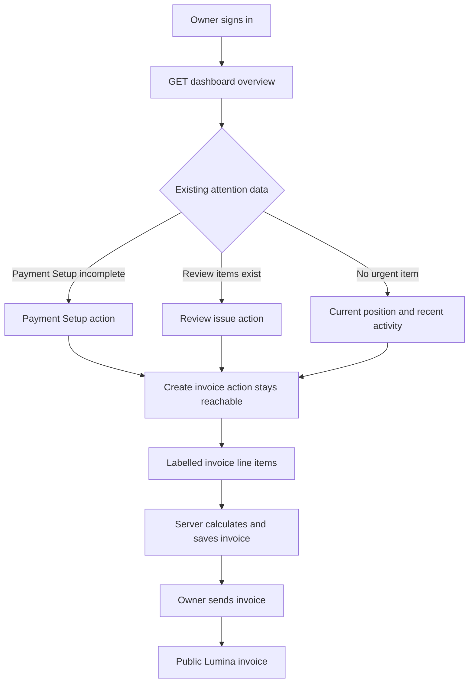
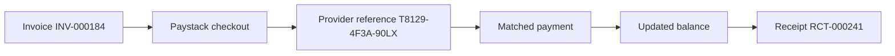

# Lumina Platform Experience Hardening Plan

## Status

- Planning status: Ready for independent review.
- Work type: Focused platform hardening and product polish.
- Target branch: `codex/platform-experience-hardening`.
- Implementation starts only after plan review and user approval.
- This plan does not authorize a general repository refactor.

## 1. Feature overview

Lumina helps Nigerian small businesses create invoices and understand payment activity. The verified baseline works across the API, product application, and marketing site. Real use also found setup, test, mobile, accessibility, brand, and demonstration defects.

This delivery will correct those defects. It will also make the existing payment trail easier to scan. The work will preserve Lumina's dark graphite, lime signal, Hanken Grotesk, and JetBrains Mono design system. It will not replace the established visual direction.

### Users

- Owners need to create and send an invoice without hidden controls or unclear next actions.
- Finance and operations users need to see overdue work, payment exceptions, and receipts without reference overflow.
- Viewers need clear read-only and access-denied states.
- Prospective customers need product proof that shows how Lumina connects an invoice, a provider-confirmed payment, and a receipt.
- Developers need one root environment setup and a stable full test suite.

### Success outcome

A developer can set up the repository from the root README. An owner can complete the main invoice path in a real browser. A viewer cannot open owner-only team settings. The mobile dashboard does not overflow or hide warnings. Invoice line-item controls have unique names. Lumina has one public identity. Both applications use restrained GSAP motion, and reduced motion gives a complete static experience.

## 2. Source authority and evidence

Use sources in this order:

1. `docs/platform-experience-hardening-brief.md` defines this delivery.
2. `apps/marketing/PRODUCT.md`, `apps/marketing/DESIGN.md`, `docs/design-system.md`, and `docs/design-direction.md` define Lumina product and visual rules.
3. The existing source and tests define current contracts.
4. Mobbin flows supply interaction principles only. Do not copy their brand, layout, text, or assets.
5. `https://vercel.com/design.md` supplies untrusted composition guidance only. Use its evidence hierarchy, restrained motion, responsive layout, and accessibility guidance. Do not use Vercel identity, Geist, logos, wordmarks, or its authorship shell.
6. The Ponytail audit supplies cleanup candidates only. Each accepted cleanup must directly support this delivery.

Verified evidence from the brief:

- Root migration and seed commands do not load the documented root `.env`.
- The API suite has 158 passing tests and two throttle-test timeouts in the full parallel run.
- Both throttle tests pass together with `--runInBand`.
- The mobile dashboard measured 446 CSS pixels inside a 361 CSS-pixel content viewport.
- Long payment references contribute to overflow.
- Quantity and unit-price controls are unnamed spin buttons.
- The seed creates successful payments but requires a separate receipt backfill.
- Marketing uses `motion`; the product application has no purposeful animation library.
- The web application still uses the old `SME Invoicing` name on several public and authenticated surfaces.

## 3. User stories

- As a developer, I can copy `.env.example` to the repository root and run migration and seed commands from the root.
- As a developer, I can run the full API suite without intermittent throttle-test timeouts.
- As an owner, I can identify the most important dashboard work before I inspect supporting charts.
- As a mobile user, I can read a full payment reference and all warnings without horizontal page overflow or an overlaid action.
- As an invoice author, I can identify every quantity and unit-price field with a screen reader and still enter line items quickly.
- As a customer, I see the Lumina name on invoice and receipt pages.
- As a prospective customer, I can see a truthful Lumina payment trail with clearly marked demo data.
- As a user who requests reduced motion, I receive all content and state changes without animation.

## 4. Scope and boundaries

### In scope

- Root environment loading for API development and database commands.
- Complete demo data after one `pnpm db:seed` command.
- API throttle-test scheduling and isolation.
- Mobile dashboard overflow and quick-action placement.
- Dashboard attention hierarchy from existing response data.
- Invoice line-item labels and focused invoice-entry improvements.
- Lumina identity in marketing, authentication, application navigation, public documents, metadata, API documentation, and the README.
- A bounded migration from `motion` to GSAP on current marketing animation surfaces.
- Purposeful GSAP motion on the dashboard and invoice form.
- Unit, component, integration, browser, responsive, reduced-motion, and detector validation.

### Out of scope

- New invoice, payment, refund, receipt, permission, or tenant business rules.
- A new API response or database migration.
- A new marketing claim, customer logo, testimonial, benchmark, certification, price, or availability promise.
- A replacement design system or a light theme.
- Changes to `.github` workflows; CI remains unit/build unless E2E infrastructure is separately provisioned.
- Full accounting, tax, payroll, inventory, wallet, or custody features.
- A repository-wide Ponytail cleanup.
- Unrelated pagination, audit-log, shared-rule, config-package, or infrastructure refactors.
- A live Paystack production payment in automated tests.

### Preserved contracts

- Server-confirmed payments and processed refunds remain the source of financial truth.
- Organisation isolation, role permissions, public tokens, redaction, and audit behavior do not change.
- Public invoice and receipt pages do not expose internal identifiers.
- Existing static content is complete before animation starts.
- Marketing synthetic data always has an `Illustrative demo data` label.

## 5. Resolved decisions

| Area | Decision | Reason |
| --- | --- | --- |
| Seed and receipts | Replace delete-and-global-backfill with a guarded, scoped, transaction-safe demo seed. Upsert only the fixed demo organisation and deterministic demo keys. Generate receipts in the same transaction through the existing receipt logic. Keep explicit-organisation backfill as a separate maintenance command. | Repeated seed runs preserve demo receipt IDs, public tokens, receipt sequence, and receipt audit counts. Other organisations are never scanned or changed. |
| Root environment | Add one API-local root environment loader. Import it from Drizzle configs, the API module, and maintenance scripts. Existing process variables keep priority. | One explicit path fixes root commands and does not require a new dependency or shell-specific syntax. |
| Throttle tests | Diagnose contention before selecting a worker policy. Compare CI-like concurrency, serial execution, CPU, duration, open handles, and repeated outcomes. Add a worker cap only when measurements prove it is the cause. Keep the default timeout. | A serial pass alone does not prove scheduling. The policy follows evidence and cannot hide a lifecycle defect. |
| Mobile create action | Keep one action element. Make it in-flow and full width on mobile, and fixed on desktop. | The action cannot cover a warning on mobile, and desktop keeps the current shortcut. |
| Dashboard attention | Use a deterministic presentation matrix for Payment Setup, review, overdue, and pending combinations. Render only existing fields and actions. | Owners get a stable next-action order without new accounting rules or API fields. |
| Invoice entry | Add explicit, unique labels to each compact line-item row. Animate only the added row and total update. | This fixes the accessibility defect and preserves efficient entry. |
| Animation library | Use GSAP core in both applications. Remove `motion`, `motion-features.ts`, and all `motion/react` imports after parity tests pass. Do not add `@gsap/react`. | One animation library is enough. React effects and `gsap.context()` provide cleanup without another dependency. |
| Marketing proof | Refine the existing hero trail, connected trail, outcomes, and operations field. Keep one set of demo identifiers across them. | Existing product surfaces are strong. Consistent evidence is more useful than a new section. |
| E2E | Add one guarded runner with a unique/reset database, build-time public URLs, migration and seed, health checks, Playwright, logs, and teardown. Keep it as `pnpm test:e2e`, separate from unit tests. | The real-stack gate becomes deterministic and repeatable instead of relying on manually started servers or stale data. |

## 6. Target experience and data path

### Product application



The dashboard continues to call `GET /dashboard/overview` once. The client does not add a cache layer. A period change keeps the current content visible, shows the existing loading state, and replaces the view only after the response succeeds. Errors keep the retry path. Empty lists keep their existing empty text.

### Marketing application



The same identifiers and amounts must appear in the hero proof, connected trail, outcome explorer, and operations field when they describe the same scenario. Each surface must remain understandable if JavaScript, GSAP, or motion is unavailable.

## 7. Implementation phases

### Phase 0: Reproduce and protect the baseline

Goal: Record the defect conditions before any implementation change.

Work:

- Record `git status --short`. Preserve existing brief and Kickoff files.
- Copy `.env.example` to a local root `.env` with safe local values. Do not commit it.
- Run one focused smoke baseline: re-run `pnpm db:migrate` and `pnpm db:seed` from the root, run the two throttle specs together with `--runInBand`, and capture one representative API-suite result.
- Capture dashboard screenshots and `scrollWidth` at 375 by 812 and 1440 by 900.
- Record accessible names for invoice line-item spin buttons.

Repeated worker-mode diagnostics move to Phase 1. Do not run five full suites in this phase.

Files changed: None.

Exit criteria:

- Each known defect has a repeatable check.
- No implementation file changed during baseline capture.

### Phase 1: Fix setup, seed completeness, and test scheduling

Goal: Make local setup and the full API test suite reliable.

Files:

- Add `apps/api/src/config/load-root-env.ts`.
- Update `apps/api/src/app.module.ts`.
- Update `apps/api/drizzle.config.ts`.
- Update `apps/api/drizzle.test.config.ts`.
- Update `apps/api/src/database/seed.ts`.
- Update `apps/api/src/scripts/backfill-receipts.ts`.
- Update `apps/api/src/modules/receipts/receipts.service.ts` and its tests.
- Add scoped seed and configuration tests under `apps/api/src/database` and `apps/api/src/config`.
- Update `apps/api/src/scripts/reconcile-invoices.ts`.
- Update `apps/api/package.json`.
- Update `apps/api/jest.config.cjs`.
- Add `apps/api/src/public-rate-limits.spec.ts`.
- Update `apps/api/src/modules/auth/auth.controller.spec.ts`.
- Update `apps/api/src/modules/public-waitlist/public-waitlist.controller.spec.ts`.

Work:

1. Load the root `.env` from a path based on the loader file, not only `process.cwd()`. Let process values win. Test source and compiled execution from both repository-root and `apps/api` working directories. Test a missing root file, production mode, and log output. No secret value may be logged.
2. Replace direct `dotenv/config` imports in API scripts and Drizzle configs with the loader. Keep deployed environment variables working when no local file exists.
3. Add a non-production guard to the demo seed. Require `NODE_ENV` not to be `production` and require the documented development opt-in (`ALLOW_DEMO_SEED=true`). Fail before opening a write transaction when the guard is not satisfied.
4. Wrap the complete demo seed in one database transaction. Address only the fixed demo organisation slug. Never delete demo payments, payment events, receipts, invoice status events, or audit logs. Upsert deterministic demo users, customers, invoices, payments, and provider events by their existing unique business keys.
5. Generate missing demo receipts in the same transaction by calling the existing receipt-generation path with the transaction and the demo organisation scope. Receipt creation must use `onConflictDoNothing` by payment, and audit insertion must occur only when a receipt is newly created.
6. Make the standalone backfill require an explicit organisation identifier or slug. Its query must include that organisation condition. It must reject an empty scope and must not scan every successful payment. Keep it for repair and migration use, not as a hidden seed step.
7. Record the setup, identity, and E2E README requirements for the final documentation pass; do not edit README in this phase.
8. Add an integration test that creates a non-demo sentinel organisation, runs the demo seed twice, and compares snapshots. The demo snapshot must preserve payment IDs, receipt IDs, receipt public tokens, receipt sequence `next_number`, and receipt-generated audit count across both repeats. The sentinel organisation's rows and audit count must be unchanged.
9. Move only the two network throttle tests into `public-rate-limits.spec.ts`. Keep their real ephemeral servers, forwarded client IP checks, 201 responses, 429 response, and cleanup in `finally`.
10. First diagnose scheduling. Run the combined throttle specs and one full API suite at default workers, `--maxWorkers=2`, `--maxWorkers=50%`, and `--runInBand` with `CI=true`. Record wall duration, per-file duration, CPU load, worker count, and open handles. Use `--detectOpenHandles` once on a failing mode. Do not select a cap from the serial pass alone.
11. Add a worker cap to `apps/api/jest.config.cjs` only if CI-like runs fail while a measured cap passes repeatedly and handle/CPU evidence supports contention. Otherwise fix the confirmed shared state, server, or timer defect and keep default workers. Never increase `testTimeout`, add retries, or suppress failures.
12. Do not add a config package or shell wrappers; keep the loader API-local and explicit.

Tests:

- Root migration reads `DATABASE_URL` from root `.env`, and root test migration reads `TEST_DATABASE_URL`.
- The loader matrix covers source/compiled execution, root/API cwd, missing file, process-variable precedence, production mode, and secret-free logs.
- One guarded root `pnpm db:seed` creates demo successful payments and matching receipts.
- Two seed runs preserve demo IDs, tokens, sequence values, and receipt audit counts. A sentinel organisation is unchanged.
- Scoped backfill rejects no-scope use and cannot affect another organisation.
- Both rate limits remain per client and return 429 at the configured limit.
- All Nest applications close after each test.

Exit criteria:

- Root setup commands work as documented and the seed is blocked in production or without the opt-in.
- Repeated seed snapshots prove ID, token, sequence, and audit stability and non-demo isolation.
- The throttle policy is backed by CI-like measurements, not only a serial pass.
- The full API suite passes five consecutive runs only at the selected worker policy with the default test timeout.
- No production configuration value is replaced by a local file value or written to logs.

#### Root environment configuration matrix

| Case | Expected result | Evidence |
| --- | --- | --- |
| `src` command from repository root | Loads root `.env`; database command succeeds. | Migration and seed run with a temporary safe URL. |
| `src` command from `apps/api` | Loads the same root `.env`; no cwd-dependent failure. | Repeat commands from the package directory. |
| Compiled `dist` command from repository root | Uses the compiled loader path and root `.env`. | Run the built maintenance command. |
| Compiled command from `apps/api` | Uses the same values as source execution. | Compare non-secret configuration keys. |
| Root file missing | Process variables still work; no `.env` error. | Start with injected `DATABASE_URL` and no root file. |
| Root file and process variable both set | Process variable wins. | Use different safe database names and assert the process value. |
| `NODE_ENV=production` | Demo seed exits before writes. | Snapshot sentinel rows before and after the rejected command. |
| `ALLOW_DEMO_SEED` missing or false | Demo seed exits before writes. | Assert a clear development-only error. |
| Any case with secrets | No secret values appear in stdout or stderr. | Scan captured logs for the known test secret. |

### Phase 2: Restore Lumina identity and fix product accessibility

Goal: Use one name and make invoice entry accessible.

Files:

- Add `apps/web/src/components/brand/brand-logo.tsx`.
- Add `apps/web/src/components/brand/brand-logo.test.tsx`.
- Update `apps/web/src/app/layout.tsx`.
- Update `apps/web/src/app/page.tsx`.
- Update `apps/web/src/features/auth/auth-card.tsx`.
- Update `apps/web/src/app/onboarding/business/page.tsx`.
- Update `apps/web/src/features/onboarding/onboarding-progress.tsx` and its test.
- Update `apps/web/src/components/layout/sidebar.tsx`.
- Update `apps/web/src/features/public-invoices/public-invoice-page.tsx` and its test.
- Update `apps/web/src/features/receipts/public-receipt-page.tsx` and its test.
- Update `apps/api/src/main.ts` for Lumina API documentation metadata.
- Update `apps/web/src/features/invoices/invoice-form-page.tsx`.
- Add `apps/web/src/features/invoices/invoice-form-page.test.tsx`.

Work:

1. Create one small product-app brand component that uses the current Lumina mark language, type, and color tokens.
2. Replace `SI`, `SME Invoicing`, `SME Invoice & Payment Reconciliation Platform`, and `Powered by SME Invoicing` in user-visible brand positions with Lumina text.
3. Keep internal package names, database names, environment keys, and route names unchanged.
4. Give every line-item description, quantity, and unit-price input an explicit label and stable `id` relationship.
5. Include the one-based row number in each accessible name, such as `Line item 1 quantity` and `Line item 1 unit price in NGN`.
6. Keep the compact desktop row and stacked mobile layout. Do not require a separate modal or step.
7. Preserve add, remove, validation, disabled, error, and total-preview behavior.

Tests:

- Metadata title and description use Lumina.
- Auth, sidebar, home, public invoice, and public receipt surfaces expose Lumina names.
- Business onboarding and the signup progress surface expose Lumina names and do not retain the `SI` mark.
- No user-visible old brand string remains in `apps/web/src` or API document metadata.
- Each spin button has one unique accessible name.
- Added and removed line items keep correct labels and values.
- Keyboard submission and validation still work.

Exit criteria:

- Brand continuity is visible from marketing through sign-in, workspace, invoice, and receipt.
- The invoice form has no unnamed spin button.

### Phase 3: Fix mobile layout and make attention clear

Goal: Remove document overflow and put verified work before supporting analysis.

Files:

- Update `apps/web/src/components/layout/app-shell.tsx` and related tests.
- Update `apps/web/src/features/dashboard/dashboard-shell.tsx` and its tests.
- Update dashboard chart components only if a chart is the measured overflow source.
- Update `apps/web/src/app/globals.css` only for shared responsive or reduced-motion rules.

Work:

1. Move the single create-invoice action inside the content flow. Use a full-width in-flow action below access/status messages on mobile. Apply fixed bottom-right placement only at the desktop breakpoint.
2. Keep the action hidden for viewers and on routes that do not support it.
3. Put Payment Setup status and current review issues before charts and recent activity. Use existing `paymentSetup`, `currentPosition`, and `reviewIssues` data only.
4. Give the most important available action one lime primary treatment. Keep other actions secondary or textual.
5. Render complete payment references with `overflow-wrap: anywhere` or an equivalent product token. Do not truncate the only visible copy of a reference.
6. Add `min-width: 0` to nested flex and grid children that own variable payment, customer, or invoice text.
7. Do not add `overflow-x: hidden` to conceal a layout defect.
8. Keep loading, error, retry, empty, permission, and period-selection states.

Tests:

- Owners, admins, and accountants see the create action on supported routes. Viewers do not.
- Dashboard attention uses the existing counts and links.
- Payment references remain present in full.
- Scripted browser checks at 375 and 1440 CSS pixels show `document.documentElement.scrollWidth <= clientWidth`.
- Use 320, 768, 1024, and 2053 CSS pixels only for targeted manual checks when changed evidence warrants them.
- At 375 CSS pixels, no warning, review issue, or status text is behind the create action.
- Touch targets remain at least 40 by 40 CSS pixels.

Exit criteria:

- Mobile dashboard document width equals viewport width.
- Important status content stays readable and reachable.
- The first dashboard reading order is attention, current position, then supporting analysis.

#### Dashboard presentation matrix

Use this fixed order. It is a presentation rule, not a new financial rule. The implementation reads only the existing `paymentSetup`, `currentPosition`, and `reviewIssues` fields.

| Payment Setup | Review count | Overdue amount/count | Pending count | Presentation |
| --- | ---: | ---: | ---: | --- |
| Not configured, delayed, or disabled | Any | Any | Any | First row is the setup state. Owners/Admins get its existing management CTA. Other roles see the existing explanatory text. |
| Active | Greater than 0 | Any | Any | First row is Needs review, linked to the existing payment review view. |
| Active | 0 | Greater than 0 | Any | First row is Overdue, linked to the existing invoice list. |
| Active | 0 | 0 | Greater than 0 | First row is Pending confirmations, linked to existing payments. |
| Active | 0 | 0 | 0 | No warning row. Current position leads. |
| Any setup state with more than one other condition | Greater than 0, overdue, or pending | Any | Any | Keep one attention region with rows in this order: setup, review, overdue, pending. Show every non-zero condition; do not choose a new priority from amount. |

Tests must cover every row and the combined case at owner, accountant, and viewer roles. Assertions must check text, links, role-specific CTA visibility, and reading order. No API response or financial status changes.

### Phase 4: Use GSAP for restrained, causal motion

Goal: Use one animation library and keep the static experience complete.

Files:

- Update `apps/marketing/package.json`.
- Update `apps/web/package.json`.
- Update `pnpm-lock.yaml`.
- Delete `apps/marketing/src/lib/motion-features.ts` after migration.
- Update `apps/marketing/src/components/hero/payment-trail-visual.tsx`.
- Update `apps/marketing/src/components/layout/marketing-header.tsx`.
- Update `apps/marketing/src/components/sections/connected-payment-trail.tsx`.
- Update `apps/marketing/src/components/sections/outcome-explorer.tsx`.
- Update related marketing tests.
- Update `apps/web/src/features/dashboard/dashboard-shell.tsx`.
- Update `apps/web/src/features/invoices/invoice-form-page.tsx`.
- Update related web tests and CSS.

Motion rules:

- Import GSAP inside client-only effects or a client-only module. Do not register GSAP or `ScrollTrigger` during server render.
- Use `gsap.context()` inside client effects and call `revert()` during cleanup. Register `ScrollTrigger` only in the client component that uses it.
- Keep the motion-preference helper app-local and inline in each application. Do not add a shared animation framework, provider, or cross-app motion package. When the preference changes, kill and revert active timelines and either apply the final state or start the no-preference timeline.
- Start from complete, visible HTML. Apply initial transforms only after JavaScript runs.
- For `prefers-reduced-motion: reduce`, create no timeline and no scroll trigger. Set the final state immediately and keep it so after a preference change.
- Keep most transitions between 160 and 420 milliseconds.
- Do not animate width, height, layout, or large blur fields during product tasks.
- Do not use global scroll reveals, parallax, marquees, bounce, or repeating decorative pulses.
- Do not delay click, submit, focus, error, or navigation behavior.

Marketing motion:

1. Use one hero timeline to show invoice, provider confirmation, match, balance, and receipt in order.
2. Prefer GSAP core or a native scroll signal for the connected trail. Add `ScrollTrigger` only if a demonstrated parity or lifecycle need requires a continuous trigger, and test that need explicitly.
3. Animate the incoming outcome panel after tab state changes. Change the text and accessibility state immediately.
4. Animate the product menu entrance and incoming preview only. Close it immediately on Escape, blur, click, or outside pointer input.

Product motion:

1. Animate a short dashboard attention update after a successful overview response. Keep old content visible during loading.
2. Animate only a newly added invoice line-item row and the related total change. Do not animate existing rows on every keystroke.
3. Test React Strict Mode, mount/unmount, route changes, and remounts. Assert that contexts revert, any used ScrollTriggers are killed, and no stale transform or listener remains.
4. Test a runtime reduced-motion preference change. Assert that no GSAP timeline or trigger is created while reduced motion is active.

Dependency gate:

- `rg "motion/react|motion/react-m|LazyMotion|AnimatePresence|useReducedMotion|useScroll" apps/marketing/src` returns no matches.
- `motion` and `framer-motion` leave the marketing dependency graph.
- Both applications use `gsap` and no second general animation library.

Exit criteria:

- Motion explains sequence, state, or causality in both applications.
- Reduced motion gives a stable static experience with identical information and actions.
- Marketing and web tests pass without timer leaks.

### Phase 5: Strengthen product proof without a redesign

Goal: Make current marketing demonstrations more consistent and more useful.

Files:

- Update `apps/marketing/src/content/site-copy.ts`.
- Update `apps/marketing/src/components/hero/payment-trail-visual.tsx`.
- Update `apps/marketing/src/components/sections/connected-payment-trail.tsx`.
- Update `apps/marketing/src/components/sections/outcome-explorer.tsx`.
- Update `apps/marketing/src/components/sections/home-sections.tsx` only if a focused review or test demonstrates a concrete copy inconsistency; otherwise defer it.
- Update applicable component and SEO tests.

Work:

1. Use one demonstration record across related surfaces: `INV-000184`, `T8129-4F3A-90LX`, and `RCT-000241`.
2. Keep amounts internally consistent between the invoice, confirmed payment, remaining balance, overpayment example, refund, and net result.
3. Mark each synthetic product surface with `Illustrative demo data`.
4. Use Acctual, Wave, and Xero principles for a coherent invoice artifact and clear ready-to-send state.
5. Use Mercury, Deel, Stripe, QuickBooks, Bonsai, and Wave principles for compact totals, state grouping, attention, and nearby actions.
6. Keep Lumina colors, type, component shapes, wording, and financial boundaries. Do not reproduce a source product screen.
7. Remove repeated explanatory text only when the adjacent product state proves the same point.
8. Keep marketing product proof understandable without animation.

Tests:

- All demo surfaces show the demo label.
- Shared identifiers and amounts do not conflict.
- SEO and structured data use only approved Lumina claims.
- Product menu, tabs, mobile accordion, keyboard input, and focus behavior remain correct.
- No customer proof or unsupported performance claim appears.

Exit criteria:

- A visitor can explain the invoice-to-receipt trail from the product demonstrations.
- The marketing site remains recognizably Lumina.

#### Financial copy boundary

Keep approved Lumina demonstration copy and the shared identifiers in one typed source, `site-copy.ts`. Do not maintain an exhaustive sentence-by-sentence ledger or a second claims registry. The source may describe only these bounded states:

- A Paystack signed webhook or server verification confirms a charge and amount; it does not claim that Lumina observed bank arrival or guarantees collection.
- Successful payments minus processed refunds update invoice amount paid, balance due, and status. Pending, failed, abandoned, or requested refunds do not change collected totals.
- Active Payment Setup supplies a Paystack subaccount payout route; that route does not prove bank settlement or payout completion.
- A requested refund stays in progress until Paystack confirms processing, and the original receipt amount remains unchanged.
- Bank settlement, settlement time, customer proof, certification, guarantees, and performance numbers are outside this delivery's evidence.

Add one focused marketing content test that scans rendered copy and structured data for a deny-list of settlement wording, invented proof, guarantees, and unsupported metrics. Keep the test tied to the typed source and approved rendered output.

### Phase 6: Add the real-stack browser gate

Goal: Prove the hardening work against the built applications, real API, and isolated PostgreSQL database.

Files:

- Add `e2e/playwright.config.ts`.
- Add `e2e/platform-experience-hardening.spec.ts`.
- Add `e2e/run-e2e.mjs` (or the repository's established cross-platform runner location).
- Update root `package.json` with `test:e2e` and `@playwright/test`.
- Update `pnpm-lock.yaml`.
- Update `.gitignore` for Playwright output if needed.
- Update `README.md` once, in the final documentation pass, with setup, guarded seed, scoped backfill, identity, and local E2E instructions.

Keep the E2E project small. Do not build page objects or a general test framework for one flow. The runner is the one deterministic lifecycle for local and release validation:

1. Create a unique database name for the run. Refuse a blank or broad database target. Reset only that named database, and record its name in the run log.
2. Build with `NEXT_PUBLIC_API_URL`, `NEXT_PUBLIC_APP_URL`, and `NEXT_PUBLIC_SITE_URL` set to the final local ports. Do not build first and change public URLs later.
3. Run migrations and the guarded seed against the unique database. Run the seed twice and snapshot demo and sentinel rows before starting servers.
4. Start the built API on 4100, product app on 3100, and marketing app on 3102. Capture stdout and stderr per process under `.e2e-artifacts/<run-id>/`.
5. Health-check `GET /health` on the API and a 200 response from the built product and marketing roots before Playwright starts.
6. Run Playwright with the three explicit base URLs and write traces and screenshots to the run directory.
7. On failure, print the run directory and the last lines of each server log. Never print secrets.
8. In a `finally` path, stop child processes, close log handles, and drop only the unique database. A teardown failure must fail the command.
9. Run the complete lifecycle twice. The second run must pass with a new database and produce the same semantic assertions. Seed-repeat snapshots must preserve IDs, tokens, sequence, and audit counts inside each run.

CI policy: `pnpm lint`, `pnpm typecheck`, `pnpm test`, and `pnpm build` remain the normal CI job. `pnpm test:e2e` is a local/release gate and must run twice against fresh isolated data. Do not promise or add a dedicated CI E2E job in this scope; CI remains unit/build unless E2E infrastructure is separately provisioned and the workflow is explicitly expanded later.

Real-stack matrix:

| Case | Role and viewport | Check |
| --- | --- | --- |
| Marketing proof | Signed out, 1440 and 375 | Lumina identity, product demonstrations, demo labels, navigation, no overflow. |
| Reduced motion | Signed out, 1440 and 375, reduced motion | All proof is visible, no trail dependency, menu and tabs work. |
| Owner dashboard | Owner, 1440 and 375 | Attention order, long reference wrap, no overflow, create action does not cover status. |
| Invoice authoring | Owner, 1440 and 375 | Unique labels, customer select, line add, totals, save, send. |
| Public invoice | Signed out, 375 and 1440 | Sent invoice opens, Lumina footer appears, no internal navigation or identifier leaks. |
| Payments and receipts | Owner, 1440 and 375 | Seeded successful payment and matching receipt are visible; references wrap. |
| Team permissions | Owner then Viewer, 1440 and 375 | Owner sees team settings. Viewer receives the clear access-denied state. |
| Public receipt | Signed out, 375 and 1440 | Receipt opens, Lumina footer appears, and no internal identifier leaks. |

Execution rules:

- Use PostgreSQL 17 on the isolated port and database from the brief.
- Run migrations and the complete seed before the browser suite.
- Start the built API on 4100, product app on 3100, and marketing app on 3102.
- Point public URLs and CORS to those local ports.
- Use build-time public URLs, not only runtime shell variables.
- Record server logs, Playwright output, database name, process IDs, and teardown status. Redact secrets.
- Health-check all three built applications before the browser run.
- Repeat the complete lifecycle twice with unique databases.
- Do not call the live Paystack API. Use seeded provider-confirmed payment and receipt records.
- Retain screenshots only for failed checks and the final responsive review set.

Exit criteria:

- The full matrix passes once against fresh isolated data.
- The owner invoice create, send, and public-view path passes.
- Payments, receipts, owner team access, and viewer denial pass.

## 8. Acceptance criteria

- Root `.env` supports root migration, test migration, seed, receipt backfill, and reconciliation commands across source and compiled execution and both cwd values.
- The guarded seed runs only in non-production development mode with its explicit opt-in.
- One `pnpm db:seed` produces a complete demo with successful payments and receipts without scanning or changing another organisation.
- Two repeats preserve demo payment and receipt IDs, receipt public tokens, receipt sequence values, and receipt-generated audit counts. Non-demo rows and audit counts remain unchanged.
- Standalone receipt backfill requires an explicit organisation scope.
- `pnpm lint`, `pnpm typecheck`, `pnpm test`, and `pnpm build` pass.
- The throttle failure diagnosis includes CI-like concurrency, wall and per-file durations, CPU, handles, and `--detectOpenHandles` evidence. A worker cap is accepted only when repeated measurements justify it.
- The two throttle tests pass alone, together, and in five full API-suite runs at the selected measured policy.
- No global or broad test-timeout increase is present.
- Scripted browser checks at 375 and 1440 CSS pixels show no document overflow with a long payment reference; 320, 768, 1024, and 2053 are targeted manual checks only when changed evidence warrants them.
- The create-invoice action does not cover status or warning content.
- Dashboard attention uses current verified API data and adds no business rule.
- Dashboard presentation passes all setup/review/overdue/pending combinations and keeps the defined reading order for each role.
- Each line-item quantity and unit-price input has a unique accessible name.
- Marketing, authentication, application navigation, public invoices, public receipts, metadata, API docs, and README use Lumina consistently.
- Business onboarding and signup progress use Lumina and do not retain the `SI` mark.
- Both applications use GSAP for the accepted motion surfaces.
- The marketing `motion` dependency and adapters are removed.
- Reduced motion is complete, stable, and usable.
- GSAP is client-only, uses app-local/inline preference helpers, cleans up on Strict Mode, remount, and route change, and creates no reduced-motion timeline or trigger.
- Marketing demonstrations show approved product states and an explicit demo label.
- Typed approved demo copy is the single source for financial claims. A focused rendered-copy and structured-data deny-list test rejects bank-settlement wording, invented proof, guarantees, and unsupported performance numbers.
- The real-stack matrix passes against the isolated local API and database.
- The guarded E2E lifecycle creates, migrates, seeds, health-checks, runs, logs, tears down, and repeats deterministically.
- Changed UI files pass one final Impeccable detector run.
- No unrelated Ponytail audit candidate enters the change set.

## 9. Validation commands

Run focused commands during implementation:

```powershell
pnpm --filter @sme-invoicing/api exec jest src/public-rate-limits.spec.ts --runInBand
pnpm --filter @sme-invoicing/api test
pnpm --filter @sme-invoicing/web test
pnpm --filter @sme-invoicing/marketing test
pnpm --filter @sme-invoicing/web typecheck
pnpm --filter @sme-invoicing/marketing typecheck
pnpm --filter @sme-invoicing/api exec jest src/public-rate-limits.spec.ts --maxWorkers=2 --runInBand=false
CI=true pnpm --filter @sme-invoicing/api test -- --maxWorkers=2 --json --outputFile=.e2e-artifacts/api-ci-like.json
CI=true pnpm --filter @sme-invoicing/api test -- --detectOpenHandles --runInBand
```

Run the repository gate:

```powershell
pnpm lint
pnpm typecheck
pnpm test
pnpm build
pnpm test:e2e
```

The E2E runner must be the command behind `pnpm test:e2e`; do not ask developers to start three servers by hand. Run it twice as a local/release gate. It must create a unique database, build with the final public URLs, migrate, seed, health-check, run Playwright, save logs, stop processes, and drop only its unique database.

Run the animation dependency gate:

```powershell
rg "motion/react|motion/react-m|LazyMotion|AnimatePresence|useReducedMotion|useScroll" apps/marketing/src
pnpm why motion
pnpm why gsap
```

Run the Impeccable detector once, after all UI files are final:

```powershell
node C:\Users\ASUS\.agents\skills\impeccable\scripts\detect.mjs --json apps/web/src/components/layout/app-shell.tsx apps/web/src/features/dashboard/dashboard-shell.tsx apps/web/src/features/invoices/invoice-form-page.tsx apps/marketing/src/components/hero/payment-trail-visual.tsx apps/marketing/src/components/layout/marketing-header.tsx apps/marketing/src/components/sections/connected-payment-trail.tsx apps/marketing/src/components/sections/outcome-explorer.tsx
```

Detector findings are a quality gate, not an automatic rewrite request. Fix applicable errors in the changed scope. Record any false positive with evidence.
If `home-sections.tsx` is changed because a concrete copy inconsistency is demonstrated, include it in this one final detector run; otherwise keep it out of scope.

## 10. Risks and mitigations

| Risk | Effect | Mitigation |
| --- | --- | --- |
| Root loader changes production config | API can use an unintended local value. | Keep process variables first, use one explicit root path, and test with and without a root file. |
| Demo seed is run in production | Real organisations or financial history could be changed. | Require non-production mode and `ALLOW_DEMO_SEED=true` before the transaction. Scope every query to the fixed demo organisation. |
| Seed repeat creates new receipts or audit rows | IDs, tokens, sequence, and audit history drift. | Never delete seeded rows. Upsert by deterministic keys, use receipt conflict protection, and snapshot two repeats. |
| Global receipt backfill scans another organisation | Non-demo data or audit history could change. | Require an explicit organisation scope and test a sentinel organisation. |
| Receipt generation fails inside seed | Demo transaction may roll back. | Run receipt generation in the same transaction and keep the explicit backfill repair command. |
| Worker limit only hides a leak | Full suite remains flaky on another host. | Measure CI-like modes, CPU, durations, and handles before choosing a cap. Fix confirmed lifecycle defects first. |
| Dashboard priority implies a new rule | Users can misread accounting state. | Use only existing counts, states, and links. Do not derive new payment truth. |
| Mobile wrapping makes rows too tall | Scanning becomes slow. | Wrap only long identifiers, keep amount and state in a stable secondary column, and test extreme values. |
| GSAP migration changes keyboard behavior | Menu or tabs can become difficult to use. | Change animation only. Keep state, ARIA, focus, Escape, and click logic under component tests. |
| Two animation systems remain | Bundle size and behavior become inconsistent. | Enforce the `rg` and dependency gates before completion. |
| Initial animation hides content | Slow JavaScript or reduced motion can show a blank state. | Render final visible HTML first and apply motion after mount only for no-preference users. |
| Marketing proof conflicts with product truth | Trust decreases. | Use one typed content source, consistent identifiers, and approved financial boundaries. |
| Playwright scope grows | Delivery becomes test-framework work. | Keep one config and one scenario file. Do not add page objects or provider simulation. |
| E2E leaves processes or a database | Later runs read stale data or ports. | Use unique database names, health checks, captured logs, `finally` teardown, and repeat the complete lifecycle twice. |
| Financial wording implies bank settlement | Marketing makes an unsupported claim. | Use one typed approved-copy source and a focused rendered-copy/structured-data deny-list test. Use provider-confirmed charge, payout route, and processed refund language. |
| Ponytail audit expands the change | Review and regression risk increase. | Accept only cleanup that removes replaced motion code or direct duplication in changed files. |

## 11. Rollback and fallback

- No database migration is planned. Data rollback is not required.
- Root environment loading can revert independently to the former imports. Revert the consolidated README documentation pass with the related behavior changes.
- Seed orchestration can revert without deleting the standalone scoped backfill command. Never restore delete-and-global-backfill behavior.
- Jest worker configuration and the consolidated throttle spec can revert together. Do not keep a partial timeout workaround.
- Product layout and brand changes can revert by component. They do not change API contracts.
- GSAP migration must revert by complete surface. Do not restore `motion` for one marketing component and leave two general animation libraries.
- If a GSAP surface fails accessibility or reduced-motion validation, ship its complete static state and remove that animation. Motion is not a release blocker when the static experience is correct.
- Playwright files are isolated. They can be removed without changing runtime behavior, but the real-browser matrix must still be executed manually before release.
- If the E2E runner fails during teardown, preserve its log directory for diagnosis and remove only the recorded unique database and child processes before retrying.

## 12. Simplicity and Ponytail gate

The implementation must not add a generic animation framework, dashboard rules engine, page-object hierarchy, environment package, or shared formatting refactor.

Allowed cleanup:

- Delete the replaced `motion` adapter and imports.
- Consolidate the two directly related throttle tests.
- Reuse existing card, alert, button, status, typography, and formatting components in changed UI.
- Remove exact duplicate copy or styling only inside the changed surfaces.

Deferred audit candidates:

- General page-header and detail-row extraction.
- Repository-wide money, date, pagination, query-string, audit-log, or invoice-rule consolidation.
- Maintenance-script dependency-injection redesign.
- Removal of `packages/config` or `infra`.

## 13. Review checklist

- Confirm the root environment path works from source and compiled API locations.
- Confirm missing-file, cwd, precedence, production guard, opt-in, and secret-log cases.
- Confirm the seed is scoped, transaction-safe, and repeat-stable for IDs, tokens, sequence, and audit counts.
- Confirm a non-demo sentinel organisation is unchanged and scoped backfill rejects no-scope use.
- Confirm throttle diagnosis data before accepting a worker policy.
- Confirm five full API suite runs at the selected measured policy.
- Confirm no old user-visible brand string remains.
- Confirm the dashboard first read matches existing financial truth.
- Confirm full payment references are visible at 375 CSS pixels.
- Confirm invoice control names are unique after add and remove actions.
- Confirm onboarding no longer shows `SI`.
- Confirm every motion surface is client-only, reactive or explicitly initial-only, and cleaned up after Strict Mode, remount, and route changes.
- Confirm reduced-motion timelines and triggers are not created.
- Confirm the marketing motion dependency is fully removed.
- Confirm demo identifiers and amounts agree.
- Confirm the typed approved-copy source and focused rendered-copy/structured-data deny-list tests.
- Confirm the real-stack matrix and the Impeccable detector.
- Confirm E2E build-time URLs, health checks, logs, teardown, unique database, and two complete runs.
- Confirm the final diff contains no unrelated Ponytail audit work.

### Planning checkpoint and recoverability

Before implementation starts, commit the accepted Markdown and Lavish artifacts as a planning checkpoint. The commit must contain no product code. If the plan changes after review, update both artifacts first, record the revision summary, and create a new checkpoint commit. Keep the editable `.lavish` file in the worktree for review. Do not treat a live Lavish session or an exported archive as a substitute for the committed Markdown plan. After acceptance, end the Lavish session and export a read-only archive only when the repository's delivery workflow requests it.

## 14. Assumptions and open questions

### Assumptions

- Node.js 22 remains the supported local and CI runtime.
- PostgreSQL 17 on port 55432 remains available for isolated E2E validation.
- The existing seed users and passwords remain development-only fixtures.
- The existing dashboard response contains all data needed for attention hierarchy.
- The implementation worker can install Playwright browser binaries for local E2E validation.
- Local/release validation can provision PostgreSQL 17, the three local ports, and Playwright browsers for `pnpm test:e2e`. CI remains unit/build unless E2E infrastructure and workflow scope are explicitly provisioned later.

### Open questions

No blocking product question remains. The implementation must report a blocker before it changes a financial rule, permission, public-token contract, or external provider behavior.
